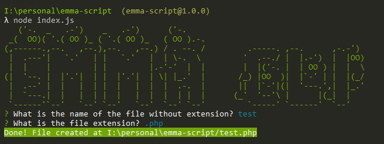

# 使用 Node.js 构建交互式命令行工具
## 目标
实现一个简单的命令行工具：创建一个用户命名的文件。

会问两个问题：
- 文件名是什么？
- 文件后缀名是什么？

然后创建文件，并展示一个包含了文件路径的成功信息。
## 新建一个项目
```bash
mkdir my-cli
cd my-cli
npm init -y
```
## 安装需要的包
```bash
npm install --save chalk figlet inquirer shelljs
```
- Chalk：正确设定终端的字符样式
- Figlet：使用普通字符制作大字母的程序（LCTT 译注：使用标准字符，拼凑出图片）
- Inquirer：通用交互式命令行用户界面的集合
- ShellJS：Node.js 版本的可移植 Unix Shell 命令行工具

## 创建一个 index.js 文件
```javascript
const run = async () => {
  // 1.show script introduction
  // 2.ask questions
  // 3.create the file
  // 4.show success message
};

run();
```
这个`index.js`的功能包括：
- 1、介绍脚本
- 2、问问题
- 3、创建文件
- 4、展示成功信息及文件路径

接下来，我们将分别实现者四个功能。
### 1、介绍
使用 `chalk` 和 `figlet` 完成。
```javascript
const init = () => {
  console.log(
    chalk.green(
      figlet.textSync("EMMA CLI", {
        font: "Ghost",
        horizontalLayout: "default",
        verticalLayout: "default"
      })
    )
  );
}

const run = async () => {
  // 1.show script introduction
  init();

  // 2.ask questions
  // 3.create the file
  // 4.show success message
};
run();
```
### 2、问问题
通过 `inquirer` 实现

```javascript
const askQuestions = () => {
  const questions = [
    {
      name: "FILENAME",
      type: "input",
      message: "What is the name of the file without extension?"
    },
    {
      name: "EXTENSION",
      type: "list",
      message: "What is the file extension?",
      choices: [".rb", ".js", ".php", ".css"],
      filter: function(val) {
        return val.split(".")[1];
      }
    }
  ];
  return inquirer.prompt(questions);
};

// ...

const run = async () => {
  // 1、show script introduction
  init();

  // 2、ask questions
  const answers = await askQuestions();
  const { FILENAME, EXTENSION } = answers;

  // 3、create the file
  // 4、show success message
};
```

### 3、创建文件
```javascript
const createFile = (filename, extension) => {
  const filePath = `${process.cwd()}/${filename}.${extension}`
  shell.touch(filePath);
  return filePath;
};

// ...

const run = async () => {
  // 1、show script introduction
  init();

  // 2、ask questions
  const answers = await askQuestions();
  const { FILENAME, EXTENSION } = answers;

  // 3、create the file
  const filePath = createFile(FILENAME, EXTENSION);

  // 4、show success message
};
```
### 4、展示信息
使用 `chalk` 。

```javascript
const success = (filepath) => {
  console.log(
    chalk.white.bgGreen.bold(`Done! File created at ${filepath}`)
  );
};

// ...

const run = async () => {
  // 1、show script introduction
  init();

  // 2、ask questions
  const answers = await askQuestions();
  const { FILENAME, EXTENSION } = answers;

  // 3、create the file
  const filePath = createFile(FILENAME, EXTENSION);

  // 4、show success message
  success(filePath);
};
```

运行 `node index.js`，可以得到



